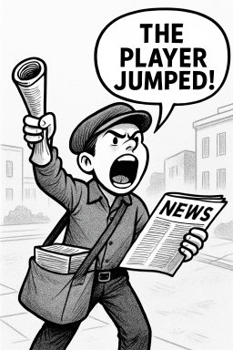
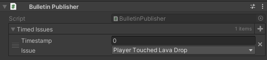
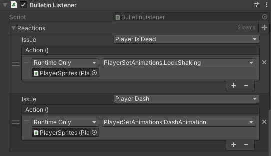
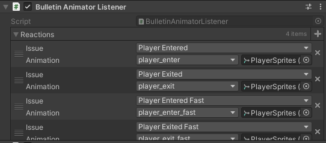
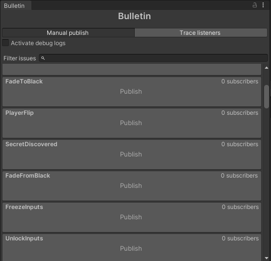
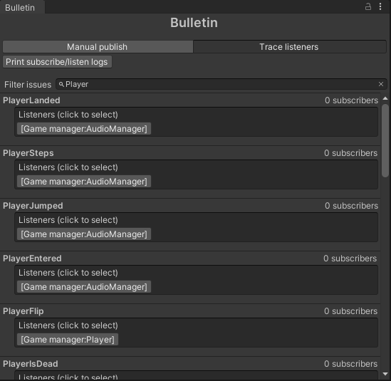

# Bulletin

Bulletin is a lightweight messaging library for Unity. It is used to publish events and to subscribe to those events with reactions. This is a useful tool to decouple parts of your game code.



## Installation

Just clone this repository wherever you want in your `Assets` folder.

## Usage

In Bulletin, messages (or events) are called issues. The main idea is that in some part of your code, you will publish an issue with `Bulletin.Publish(issue)`. In an other part of your code, you will subscribe to this issue with `Bulletin.Subscribe(issue, action)`. During gameplay, when the issue is published, the subscribed action will automatically be invoked.

For instance in your character controller, you might want to play a sound when the player jumps. Well, instead of calling the audio system directly in `Jump()`, tighly coupling your character controller with the audio system, you will instead publish an issue with `Bulletin.Publish(Issue.PlayerJumped)`:

```csharp
public class CharacterController : MonoBehaviour {
    private void Update() {
        if (Input.GetKeyDown(KeyCode.Space))
            Jump();
    }

    private void Jump() {
        // Jump logic
        Bulletin.Publish(Issue.PlayerJumped);
    }
}
```

The character controller does not need to know anything about the audio system. It just publishes an issue when the player jumps. The audio system then takes care of subscribing to this issue and playing the sound:

```csharp
public class AudioSystem : MonoBehaviour {
    public AudioClip jumpSound;

    private void OnEnable() {
        Bulletin.Subscribe(Issue.PlayerJumped, () => Play(jumpSound));
    }

    private void Play(AudioClip audioClip) { 
        // Play the sound logic
    }
}
```

With this, we successfully achieved [separation of concerns](https://en.wikipedia.org/wiki/Separation_of_concerns). Decoupling our code and making it more modular and maintainable.

Don't forget to unsubscribe from the issue when the audio system is disabled.

```csharp
private void OnDisable() {
    Bulletin.Unsubscribe(Issue.PlayerJumped, () => Play(jumpSound));
}
```

Now maybe we want to play an animation when the player jumps. Well, no need to change anything in the character controller. We can just subscribe to the issue in the animation system:

```csharp
public class AnimationSystem : MonoBehaviour {
    public Animator animator;

    private void OnEnable() {
        Bulletin.Subscribe(Issue.PlayerJumped, () => animator.Play("Jump"));
    }
}
```

### Adding new issues

How do we add new issues? We just populate the enum in `Issue.cs` with the appropriate issues we want to publish. For instance:

```csharp
public enum Issue
{
    PlayerJumped,
    PlayerLanded,
    UpdatedControlScheme,
    CutsceneEnded,
    ...
}
```

Make sure you add new issues only at the end of the enum or it can screw up inspector references.

## Utility MonoBehaviours

Bulletin comes with a few utility components that you can use to setup up chain of issues and reactions directly from the Unity Inspector.

### BulletinPublisher



Used to publish Bulletin issues through the inspector, optionally with a delay. You can assign this component in UnityEvents and target the Publish() method to publish the issue when the UnityEvent is triggered.

### BulletinListener



Used to subscribe UnityEvents to Bulletin issues. Bulletin then invokes UnityEvents as issues are published.
Use this to setup reactions to Bulletin issues in the inspector.

### BulletinAnimatorListener

> This component requires MyBox library (https://github.com/Deadcows/MyBox) for the `AnimationStateReference` class. Because of this, the file `BulletinAnimatorListener.cs` is commented out by default. If you have MyBox installed, feel free to uncomment the code at `Bulletin/BulletinAnimatorListener.cs` to make it available in the inspector.



Used to play animations as reactions to Bulletin issues.

## Dashboard
There is a dashboard for the Bulletin system.
It can be useful to debug and manage issues.
It allows you to manually publish issues and to trace listeners.

Access it through the top menu "Tools/Bulletin".

### Dashboard - Publish tab


Lists all issues and subscribers numbers.

- Use the search box to filter the issues.
- Toggle the debug checkbox to print debug logs in the console.
- Click on any issue to publish it. Equivalent to calling `Bulletin.Publish(issue)` from the code.

### Dashboard - Trace listeners tab


Lists all GameObjects listening for each issue. Only logs gameobjects when an issue was subscribed to with `Bulletin.Subscribe(issue, unityEvent, gameobject)`. If it was subscribed with `Bulletin.Subscribe(issue, action)`, it will not be listed.

- Use the search box to filter the issues.
- Click on any GameObject to select it in the hierarchy.

## Used by

[](https://palenight.prettyfrenchgames.com)
[](https://cosmos.prettyfrenchgames.com)


## License
This project is licensed under the MIT License - see the [LICENSE](./LICENSE) file for details.

This means you can use this library in your own projects, commercial or not, as long as you include a copy of the original license file in your project.

Attribution is not required, but appreciated.